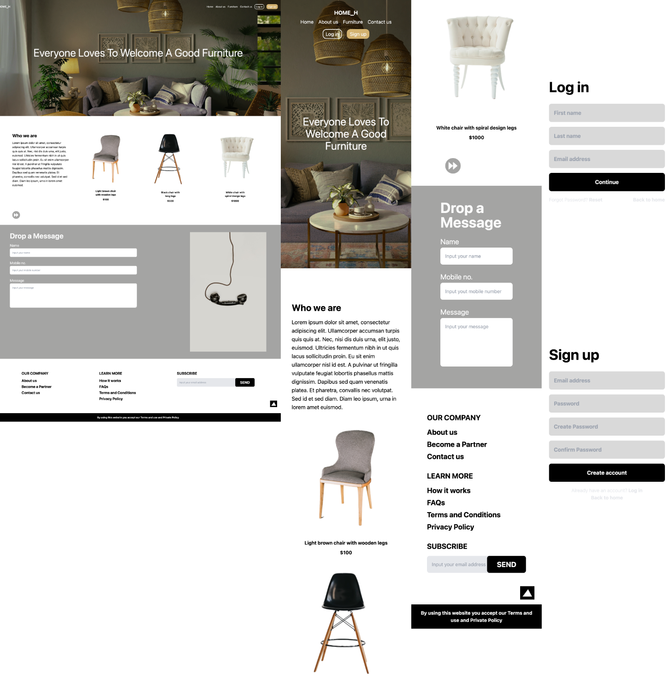

# SuperCode Furniture Website - React, TailwindCSS

## Purpose of the website

- Create an Furniture Website
- Routing with React Router DOM
- Styling with TailwindCSS

## Built with

- Responsive Design
- Grid and Flexbox Layout
- [React](https://react.dev/)
- React Router DOM
- [TailwindCSS](https://tailwindcss.com/)

## Links

- [See live site here](https://super-code-furniture.vercel.app/)
- [GitHub Repository](https://github.com/thomaserdmenger/superCode-Furniture)
- [GitHub Author](https://github.com/thomaserdmenger)
- [LinkedIn Author](https://www.linkedin.com/in/thomaserdmenger/)

## Screenshot-Image

